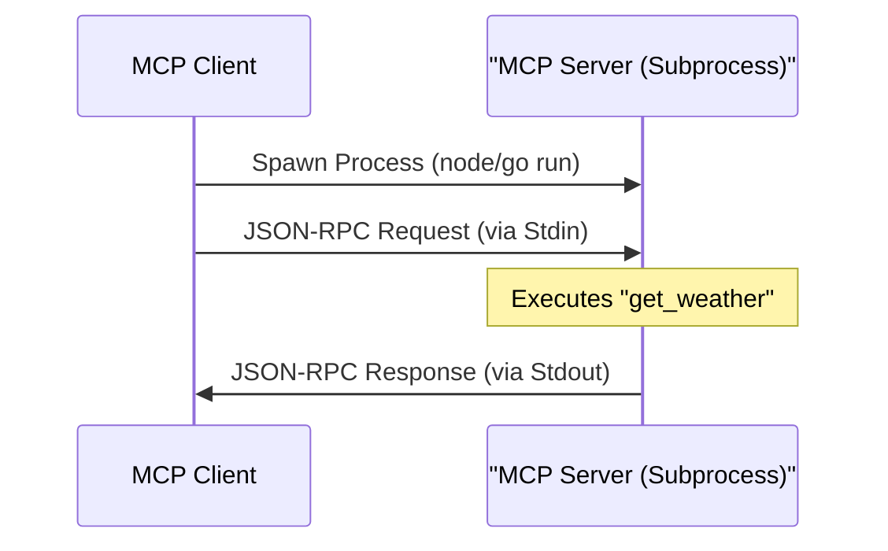
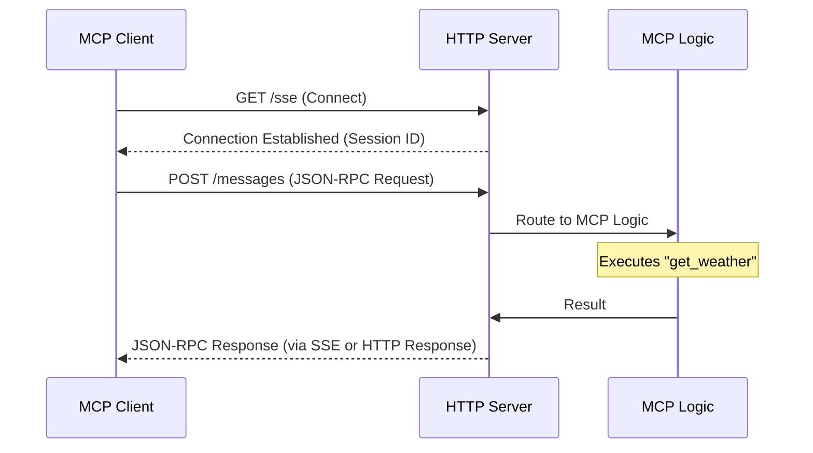
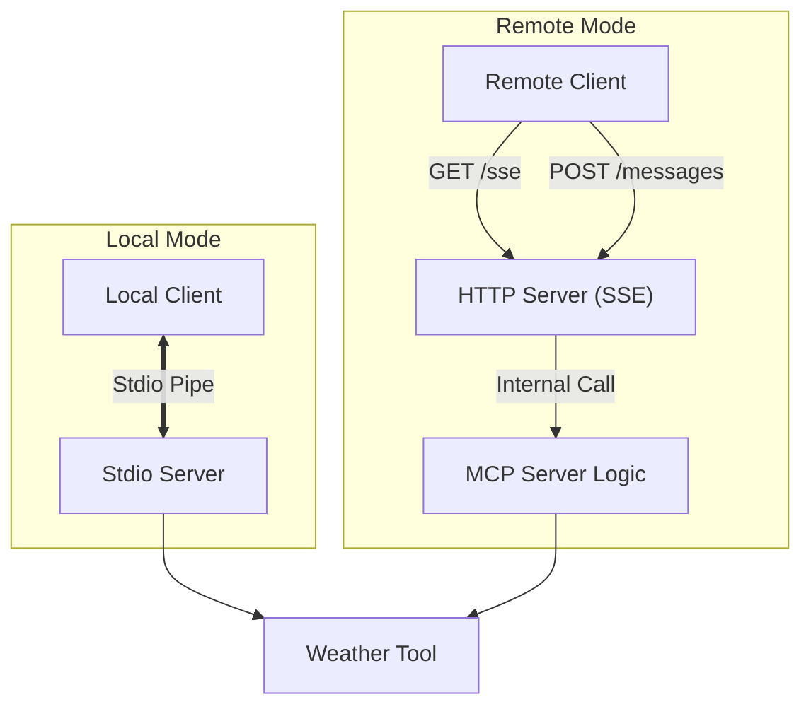

# System Architecture

This document visualizes how the MCP Client and Server communicate in both **Local** and **Remote** modes.

## 1. Local Connection (Stdio Transport)
In this mode, the Client spawns the Server as a subprocess. They communicate directly via Standard Input (Stdin) and Standard Output (Stdout). This is ideal for local, secure tools.

## 2. Remote Connection (SSE Transport)
In this mode, the Server runs as an HTTP Service (using Express or net/http). The Client connects via HTTP.
*   **SSE (`/sse`)**: Used for server-to-client events (like notifications).
*   **POST (`/messages`)**: Used for client-to-server requests.

## High Level Overview

