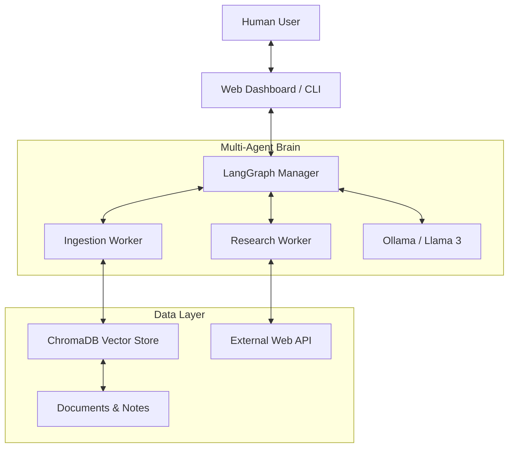

# Roadmap: The Personal Knowledge Assistant ("Second Brain")

This roadmap outlines the journey to building a fully private, context-aware AI assistant that lives on your machine and manages your knowledge.

## Project Vision
An agent that doesn't just "chat," but remembers your notes, researches for you, and helps you organize your life—without ever sending your data to the cloud.

---

## Milestone 1: Local Context Foundation
**Goal**: Migration to 100% local operation with RAG.
- [ ] **Local LLM Integration**: Port the Manager to use Ollama (Llama 3/Mistral).
- [ ] **Vector Persistence**: Move from in-memory to persistent ChromaDB storage.
- [ ] **Unified Interface**: Create a single entry point `src/brain.ts` that combines memory and tools.

## Milestone 2: Automated Ingestion
**Goal**: Make the "Second Brain" self-updating.
- [ ] **Ingestion Worker**: A specialized worker that watches a `~/Brain/Inbox` folder.
- [ ] **Auto-Parsing**: Support for PDF, Markdown, and Word documents using MCP servers.
- [ ] **Metatdata Tagging**: Automatically categorize notes by topic during indexing.

## Milestone 3: Web-Enhanced Research
**Goal**: Give your local agent "eyes" on the live world.
- [ ] **Research Tool**: Integrate a web-search MCP server (Brave Search or Tavily).
- [ ] **Cross-Checking**: Manager should compare local knowledge with web search results.
- [ ] **Citations**: Implementation of a "Source" field so you know where information comes from.

## Milestone 4: Better Interfaces
**Goal**: Move beyond the terminal.
- [ ] **Web Dashboard**: An interactive UI to see indexed documents and chat.
- [ ] **Human-in-the-Loop**: Nodes in the graph that pause for your approval before taking action.
- [ ] **Long-Term Memory**: Implementation of "summary" buffers so the agent remembers you across sessions.

---

## Architectural Growth Plan

## Getting Started
The immediate first step is **Phase 2 (Ollama Integration)**, which serves as the privacy engine for this entire project.
